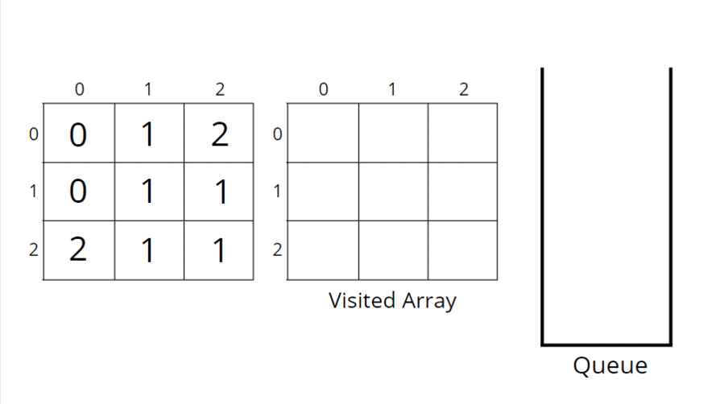

## 994. Rotting Oranges

[Visit Problem](https://leetcode.com/problems/rotting-oranges/description/)

**Approach :** 

-   For BFS traversal, we need a queue data structure and a visited array. Create a replica of the given array, i.e., create another array of the same size and call it a visited array. We can use the same matrix, but we will avoid alteration of the original data.

-   The pairs of cell number and initial time, `i.e., <<row, column>`, time> will be pushed in the queue and marked as visited (represents rotten) in the visited array. For example, `((2,0), 0)` represents cell `(2, 0)`and initial time `0`.

-   While BFS traversal, pop out an element from the queue and travel to all its neighbours. In a graph, we store the list of neighbours in an adjacency list but here we know the neighbours are in 4 directions

-   We go in all 4 directions and check for valid unvisited fresh orange neighbours. To travel 4 directions we will use nested loops, you can find the implementation details in the code.

-   BFS function call will make sure that it starts the BFS call from each rotten orange cell, and rotten all the valid fresh orange neighbours and puts them in the queue with an increase in time by 1 unit. Make sure to mark it as rotten in the visited array.

-   Pop-out another rotten orange from the queue and repeat the same steps until the queue becomes empty.

-   Add a counter variable to store the maximum time and return it. If any of the fresh was not rotten in the visited array then return -1.

**Consider the following example to understand how BFS traverses the cells and rotten the oranges accordingly.:** 

**Complexity Analysis :** 

-   Time Complexity: `O(NxM + NxMx4) ~ O(N x M)`, For the worst case, all of the cells will have fresh oranges, so the BFS function will be called for `(N x M)` nodes and for every node, we are traversing for 4 neighbours, it will take `O(N x M x 4)` time.

-   Space-Complexity: `~ O(N x M), O(N x M)` for copied input array and recursive stack space takes up `N x M` locations at max

**References :** 
[Learn From Article](https://takeuforward.org/data-structure/rotten-oranges/)
[Get helpful Video](https://youtu.be/yf3oUhkvqA0)
