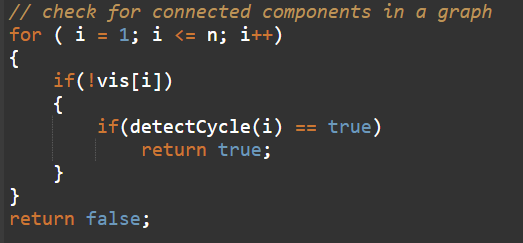
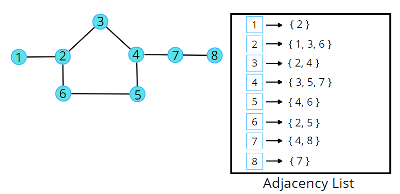
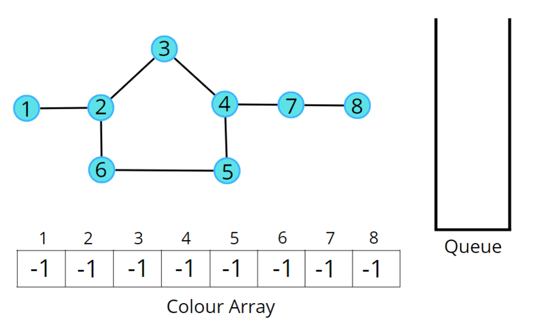

## Bipartite Graph

[Visit Problem](https://leetcode.com/problems/is-graph-bipartite/description/)

**Intuition :** 
A bipartite graph is a graph which can be coloured using 2 colours such that no adjacent nodes have the same colour. Any linear graph with no cycle is always a bipartite graph. With cycle, any graph with an even cycle length can also be a bipartite graph. So, any graph with an odd cycle length can never be a bipartite graph. 

The intuition is the brute force of filling colours using any traversal technique, just make sure no two adjacent nodes have the same colour. If at any moment of traversal, we find the adjacent nodes to have the same colour, it means that there is an odd cycle, or it cannot be a bipartite graph.  

**Approach :** 

We can follow either of the traversal techniques. In this article, we will be solving it using BFS traversal.  

Breadth First Search, BFS is a traversal technique where we visit the nodes level-wise, i.e., it visits the same level nodes simultaneously, and then moves to the next level. We will be defining the BFS traversal below, but this check has to be done for every component, for that we can use the simple for loop concept that we have learnt, to call the traversals for unvisited nodes.  

 

**Initial configuration :** 

-   Queue: Define a queue and insert the source node initially to start with.
-   Colour array: Instead of a visited array, we will take a colour array where all the nodes are initialised to -1 indicating they are not coloured yet.

**The algorithm steps are as follows :** 

-   For BFS traversal, we need a queue data structure and a visited array (in this case colour array).
-   Take the source node and push it into the Queue. Whenever we try to put it in the queue, we assign a colour to the node. We will try to colour with 0 and 1, but you can choose other colours as well. We will start with the colour 0, you can start with 1 as well, just make sure for the adjacent node, it should be opposite of what the current node has.
-   Start the BFS traversal, pop out an element from the queue every time and travel to all its uncoloured neighbours using the adjacency list.
-   For every uncoloured node, initialise it with the opposite colour to that of the current node, and push it into the Q data structure, for further traversals.
-   Repeat the steps either until the queue becomes empty.
-   If at any moment, we get an adjacent node from the adjacency list which is already coloured and has the same colour as the current node, we can say it is not possible to colour it, hence it cannot be bipartite. Thereby we will stop the check here, and return a false, without visiting any further nodes.
-   If the queue becomes empty, the graph is coloured and no two adjacent nodes have the same colour then return value 1 indicating it is a bipartite graph.

 
Consider the following graph and its adjacency list. 

 

 
Consider the following illustration to understand the colouring of the nodes using BFS traversal. 

   

**Complexity Analysis :** 

-   Time Complexity: `O(V + 2E)`, Where V = Vertices, 2E is for total degrees as we traverse all adjacent nodes.
-   Space Complexity: `O(3V) ~ O(V)`, Space for queue data structure, colour array and an adjacency list.

**References :** 
[Article](https://takeuforward.org/graph/bipartite-graph-bfs-implementation/)
[Video](https://www.youtube.com/watch?v=-vu34sct1g8&list=PLgUwDviBIf0oE3gA41TKO2H5bHpPd7fzn&index=17)
