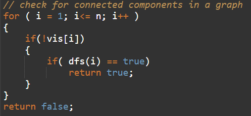
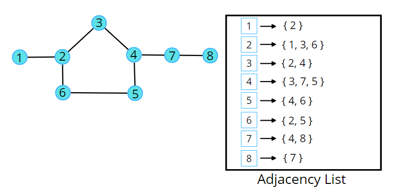
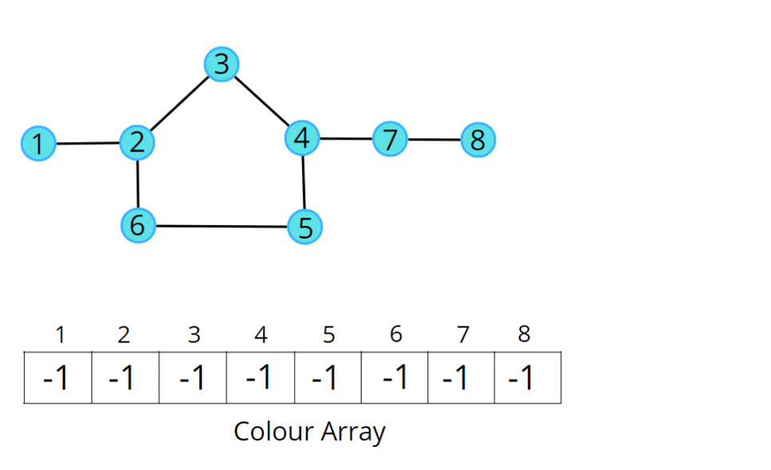

## Bipartite Graph

[Visit Problem](https://leetcode.com/problems/is-graph-bipartite/description/)

**Intuition :** 
A bipartite graph is a graph which can be coloured using 2 colours such that no adjacent nodes have the same colour. Any linear graph with no cycle is always a bipartite graph. With a cycle, any graph with an even cycle length can also be a bipartite graph. So, any graph with an odd cycle length can never be a bipartite graph. 

The intuition is the brute force of filling colours using any traversal technique, just make sure no two adjacent nodes have the same colour. If at any moment of traversal, we find the adjacent nodes to have the same colour, it means that there is an odd cycle, or it cannot be a bipartite graph.  

**Approach :** 

We can follow either of the traversal techniques. In this article, we will be solving it using DFS traversal.  

DFS is a traversal technique which involves the idea of recursion and backtracking. DFS goes in-depth, i.e., traverses all nodes by going ahead, and when there are no further nodes to traverse in the current path, then it backtracks on the same path and traverses other unvisited nodes.  

We will be defining the DFS traversal below, but this check has to be done for every component, for that we can use the simple for loop concept that we have learnt, to call the traversals for unvisited nodes. 

 

**The algorithm steps are as follows :** 

-   For DFS traversal, we need a start node and a visited array but in this case, instead of a visited array, we will take a colour array where all the nodes are initialised to -1 indicating they are not coloured yet.

-   In the DFS function call, make sure to pass the value of the assigned colour, and assign the same in the colour array. We will try to colour with 0 and 1, but you can choose other colours as well. We will start with the colour 0, you can start with 1 as well, just make sure for the adjacent node, it should be opposite of what the current node has.

-   In DFS traversal, we travel in-depth to all its uncoloured neighbours using the adjacency list. For every uncoloured node, initialise it with the opposite colour to that of the current node.

-   If at any moment, we get an adjacent node from the adjacency list which is already coloured and has the same colour as the current node, we can say it is not possible to colour it, hence it cannot be bipartite. Thereby return a false indicating the given graph is not bipartite; otherwise, keep on returning true.

 
Consider the following graph and its adjacency list. 

 

 
Consider the following illustration to understand the colouring of the nodes using BFS traversal. 

   

**Complexity Analysis :** 

-   Time Complexity: `O(V + 2E)`, Where V = Vertices, 2E is for total degrees as we traverse all adjacent nodes.
-   Space Complexity: `O(3V) ~ O(V)`, Space for DFS stack data structure, colour array and an adjacency list.

**References :** 

-   [Article](https://takeuforward.org/graph/bipartite-graph-dfs-implementation/)
-   [Video](https://www.youtube.com/watch?v=KG5YFfR0j8A&list=PLgUwDviBIf0oE3gA41TKO2H5bHpPd7fzn&index=18)
