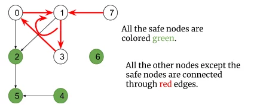

## 802. Find Eventual Safe States

[Visit Problem](https://leetcode.com/problems/find-eventual-safe-states/description/)

**Approach :** 
A terminal node is a node without any outgoing edges(i.e out-degree = 0). Now a node is considered to be a safe node if all possible paths starting from it lead to a terminal node. Here we need to find out all safe nodes and return them sorted in ascending order. 

If we closely observe, all possible paths starting from a node are going to end at some terminal node unless there exists a cycle and the paths return back to themselves. Let’s understand it considering the below graph: 

 

-   In the above graph, there exists a cycle i.e 0->1->3->0, and node 7 is connected to the cycle with an incoming edge towards the cycle.
-   Some paths starting from these nodes are definitely going to end somewhere in the cycle and not at any terminal node. So, these nodes are not safe nodes.
-   Though node 2 is connected to the cycle, the edge is directed outwards the cycle and all the paths starting from it lead to the terminal node 5. So, it is a safe node and the rest of the nodes (4, 5, 6) are safe nodes as well.

So, the intuition is to figure out the nodes which are either a part of a cycle or incoming to the cycle. 

Note: Points to remember that any node which is a part of a cycle or leads to the cycle through an incoming edge towards the cycle, cannot be a safe node. Apart from these types of nodes, every node is a safe node.

**Complexity Analysis :** 

-   Time Complexity: `O(V+E)+O(V)`, where `V = no. of nodes and E = no. of edges`. There can be at most V components. So, another `O(V)` time complexity.

-   Space Complexity: `O(3N) + O(N) ~ O(3N): O(3N)` for three arrays required during dfs calls and `O(N) `for recursive stack space.

**References :** 

-   [From Article](https://takeuforward.org/data-structure/find-eventual-safe-states-dfs-g-20/)
-   [Video References](https://www.youtube.com/watch?v=uRbJ1OF9aYM&list=PLgUwDviBIf0oE3gA41TKO2H5bHpPd7fzn&index=20)
