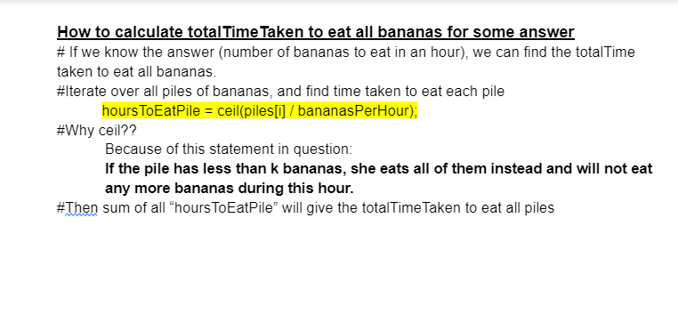

## 875. Koko Eating Bananas

[Visit Problem](https://leetcode.com/problems/koko-eating-bananas/description/)

**Approach :** 
    

**why we are using double typecasting ? :** 
`long long hoursToEatPile = ceil(piles[i] / (double)bananasPerHour)`;
becoz here both `piles[i]` and `bananasPerHour` are integers,  
and so this expression `piles[i] / bananasPerHour` returns an integer as well   

for eg: if p`iles[i] = 10 & bananasPerHour = 3`,  
`piles[i] / bananasPerHour` will give us `10/3 = 3` ( integer division as we call it) 
so ur `ceil` function wont have any use becoz it will do `ceil(10/3) = ceil(3) = 3`  

but if u typecast any one of `piles[i] or bananasPerHour to (double)`, 
the result of `piles[i] / bananasPerHour` will give us `10/3 = 3.3333..` 
and now ur `ceil` function will do `ceil(10/3) = ceil(3.33...) = 4` 

**References :** 

[From Leet-Code](https://leetcode.com/problems/koko-eating-bananas/solutions/3270468/complete-intuition-to-use-binary-search-explained-easy-to-understand/)
