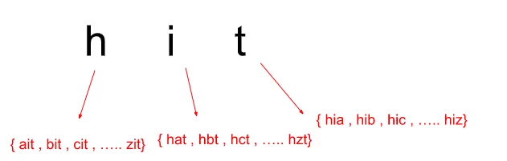
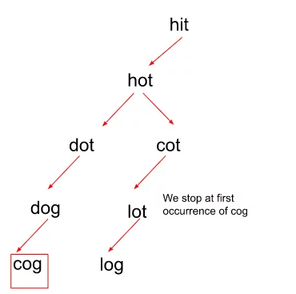

## 127. Word Ladder

[Visit Problem](https://leetcode.com/problems/word-ladder/description/)

**Approach :** 

Let’s first understand the Brute force approach to this problem. In Brute force, we just simply replace the startingWord character by character and then check whether the transformed word is present in the wordList. If a word is present in the wordList, we try replacing another character in that word by again following similar steps as above, in order to attain the targetWord. We do this for all the characters in the startWord and then eventually return the minimum length of transforming the startWord to targetWord.  

  

**The Algorithm involves the following steps :** 

-   Firstly, we start by creating a queue data structure in order to store the word and the length of the sequence to reach that word as a pair. We store them in form of {word, steps}.
-   Then, we push the startWord into the queue with length as ‘1’ indicating that this is the word from which the sequence needs to start from.
-   We now create a hash set wherein, we put all the elements in wordList to keep a check on if we’ve visited that word before or not. In order to mark a word as visited here, we simply delete the word from the hash set. There is no point in visiting someone multiple times during the algorithm.
-   Now, we pop the first element out of the queue and carry out the BFS traversal where, for each word popped out of the queue, we try to replace every character with ‘a’ – ‘z’, and we get a transformed word. We check if the transformed word is present in the wordList or not.
-   If the word is present, we push it in the queue and increase the count of the sequence by 1 and if not, we simply move on to replacing the original character with the next character.
-   Remember, we also need to delete the word from the wordList if it matches with the transformed word to ensure that we do not reach the same point again in the transformation which would only increase our sequence length.
-   Now, we pop the next element out of the queue ds and if at any point in time, the transformed word becomes the same as the targetWord, we return the count of the steps taken to reach that word. Here, we’re only concerned about the first occurrence of the targetWord because after that it would only lead to an increase in the sequence length which is for sure not minimum.
-   If a transformation sequence is not possible, return 0.

**Intuition :** 

The intuition behind using the BFS traversal technique for this particular problem is that if we notice carefully, we go on replacing the characters one by one which seems just like we’re moving level-wise in order to reach the destination i.e. the targetWord.  

  
In level-order traversal, when we reach the destination, we stop the traversal. Similar to that, when we reach our targetWord, we terminate the algorithm and return the counted steps. 

We no longer continue the algorithm after that because that would only increase the step count to reach the targetWord. 

**Complexity Analysis :** 

-   Time Complexity: `O(N * M * 26)`, Where N = size of wordList Array and M = word length of words present in the wordList.. Note that, hashing operations in an unordered set takes O(1) time, but if you want to use set here, then the time complexity would increase by a factor of log(N) as hashing operations in a set take O(log(N)) time.

-   Space-Complexity: ` O( N )` { for creating an unordered set and copying all values from wordList into it } Where N = size of wordList Array

**References :** 

-   [Helpful Article](https://takeuforward.org/graph/word-ladder-i-g-29/)
-   [Video](https://www.youtube.com/watch?v=tRPda0rcf8E&list=PLgUwDviBIf0oE3gA41TKO2H5bHpPd7fzn&index=29)
