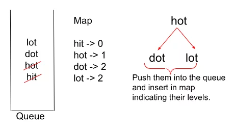
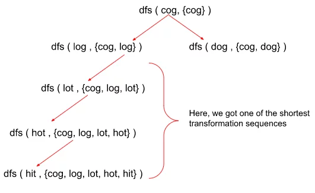

## Word Ladder-II (Optimized Approach)

[Visit Problem](https://leetcode.com/problems/word-ladder-ii/submissions/)

**Approach :** 
**The Algorithm is divided into majorly 2 steps :** 
<b>Step 1: </b> Finding the minimum number of steps to reach the endWord and storing the step number for every string in a data structure. So that we can backtrack at later stages.  

-   We follow a similar approach as that of the Word Ladder-I problem to find out the minimum number of steps in order to transform the beginWord to the endWord.
-   First, insert the beginWord in a queue data structure and then start the BFS traversal.
-   Now, we pop the first element out of the queue and carry out the BFS traversal where, for each word popped out of the queue, we try to replace every character with ‘a’ – ‘z’, and we get a transformed word. We check if the transformed word is present in the wordList or not
-   If the word is present, we push it in the queue as well as push in the map and increase the count of level by 1 in the map. If the word is not present, we simply move on to replacing the original character with the next character.
-   Remember, we also need to delete the word from the wordList if it matches with the transformed word to ensure that we do not reach the same point again in the transformation which would only increase our sequence length.
-   Now, we pop the next element out of the queue ds and if at any point in time, the transformed word becomes the same as the targetWord, we stop the BFS.

     
       

<b>Step 2: </b> Backtrack in the map from end to beginning to get the answer sequences. 

-   We follow the DFS traversal here but in a reverse manner.
-   Starting from only the targetWord in the sequence we replace the character by character from a-z in that word and check whether the transformed word is present in the map and at the previous level of the targetWord or not.
-   If that is the case, we push the word into the sequence and then continue a similar traversal until we reach the beginWord.
-   Following this technique eventually, we would get all the shortest possible sequences to reach from beginWord to targetWord but in reverse order. So the moment we encounter the beginWord in the traversal, we reverse the current sequence, insert it into the answer array and then re-reverse it to continue the DFS traversal as it is.

 
       

**Complexity Analysis :** 

-   [From Article](https://takeuforward.org/graph/word-ladder-ii-optimised-approach-g-31/)
-   [From Video](https://www.youtube.com/watch?v=AD4SFl7tu7I&list=PLgUwDviBIf0oE3gA41TKO2H5bHpPd7fzn&index=31)
