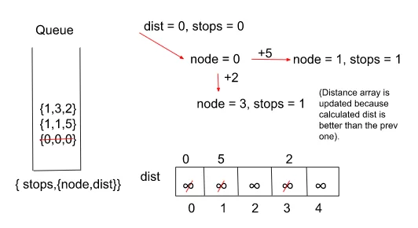

## 787. Cheapest Flights Within K Stops

[Visit Problem](https://leetcode.com/problems/cheapest-flights-within-k-stops/description/)

**Intuition :** 

Since in this problem, we have to calculate the minimum cost to reach the destination from the source but with a restriction on the number of stops, we would be using Dijkstra’s Algorithm. Now, one must wonder that based on what parameter we should add elements to the priority queue. 

Now, if we store the elements in the priority queue with the priority given to the minimum distance first, then after a few iterations we would realize that the Algorithm will halt when the number of stops would exceed. This may result in a wrong answer as it would not allow us to explore those paths which have more cost but fewer stops than the current answer. 

To tackle this issue, we store the elements in terms of the minimum number of stops in the priority queue so that when the algorithm halts, we can get the minimum cost within limits. 

Also, a point to note here is that do we really need a priority queue for carrying out the algorithm? The answer for that is No because when we are storing everything in terms of a number of stops, the stops are increasing monotonically which means that the number of sops is increasing by 1 and when we pop an element out of the queue, we are always popping the element with a lesser number of stops first. Replacing the priority queue with a simple queue will let us eliminate an extra log(N) of the complexity of insertion-deletion in a priority queue which would in turn make our algorithm a lot faster. 

**Approach :**  

# The Algorithm consists of the following steps :
- Start by creating an adjacency list, a queue that stores the distance-node and stops pairs in the form {stops,{node,dist}} and a dist array with each node initialized with a very large number ( to indicate that they’re unvisited initially) and the source node marked as ‘0’.
- We push the source cell to the queue along with its distance which is also 0 and the stops are marked as ‘0’ initially because we’ve just started.
- Pop the element at the front of the queue and look out for its adjacent nodes. 
- If the current dist value of a node is better than the previous distance indicated by the distance array and the number of stops until now is less than K, we update the distance in the array and push it to the queue. Also, increase the stop count by 1.
- We repeat the above three steps until the queue becomes empty. Note that we do not stop the algorithm from just reaching the destination node as it may give incorrect results.
- Return the calculated distance/cost after we reach the required number of stops. If the queue becomes empty and we don’t encounter the destination node, return ‘-1’ indicating there’s no path from source to destination.

Here’s a quick demonstration of the Algorithm’s 1st iteration for example 1 stated above ( all the further iterations would be done in a similar way ) :   
 

**Complexity Analysis :** 
- Time-Complexity: `O( N )` { Additional log(N) of time eliminated here because we’re using a simple queue rather than a priority queue which is usually used in Dijkstra’s Algorithm }. Where N = Number of flights / Number of edges.
- Space-Complexity: `O(|E| + |V|)`,  { for the adjacency list, priority queue, and the dist array }.Where E = Number of edges (flights.size()) and V = Number of Airports.

**References :** 
- [From Video](https://www.youtube.com/watch?v=9XybHVqTHcQ&t=20s)
- [From Article](https://takeuforward.org/data-structure/g-38-cheapest-flights-within-k-stops/)
