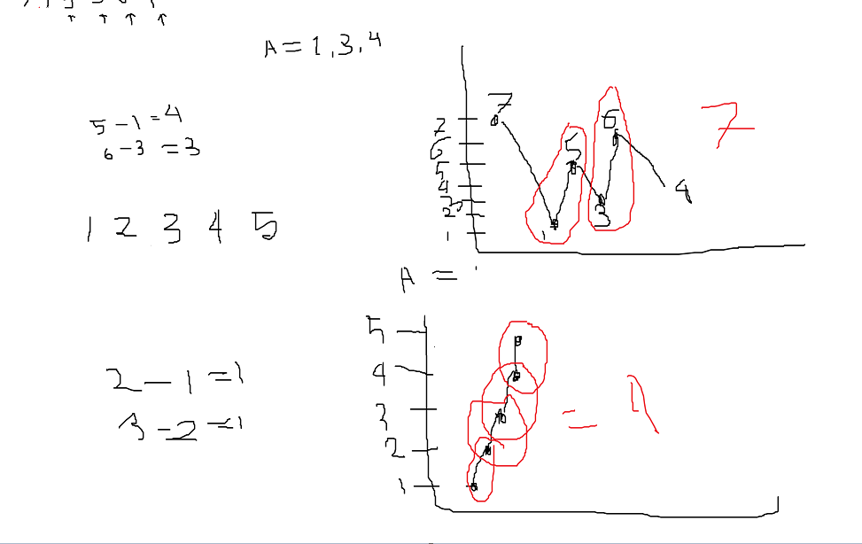

## 122. Best Time to Buy and Sell Stock II

This problem involved about,you are given an integer array prices where prices[i] is the price of a given stock on the ith day. return the maximum profit you can achieve.

# Problem description

For better problem description, please visit [LeetCode Page](https://leetcode.com/problems/best-time-to-buy-and-sell-stock-ii/description/)

**Approach :** 

-   The idea behind solve this problem is simple approach
-   each time we check the current item is greater than previous item, this is the way to earn maximum profit

** Image description :** 

-   

**Complexity :** 

-   Time-Complexity: `O(n)` - We iterate over the array and calculate profit, which can be done in `O(n)` time.
-   Space-Complexity: `O(1)` - We are not using any additional data structures or allocating extra memory that grows with the input size. Therefore, the space complexity is constant, represented as `O(1)`.
