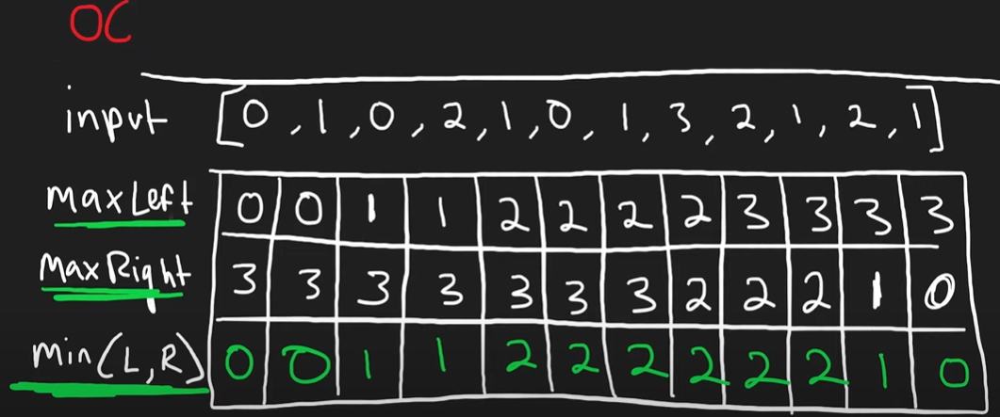

## 42. Trapping Rain Water

This problem involved about, given n non-negative integers representing an elevation map where the width of each bar is 1, compute how much water it can trap after raining.  

# Problem description

For better problem description, please visit [LeetCode Page](https://leetcode.com/problems/trapping-rain-water/description/)

**Approach (with extra spaces) :** 

## 

1. Initialize three vectors: `maxLeftHeight`, `maxRightHeight`, and `minValue`, all of size `n`.
2. Traverse the `height` vector to calculate the maximum height to the left of each element and store it in `maxLeftHeight`.
3. Traverse the `height` vector in reverse order to calculate the maximum height to the right of each element and store it in `maxRightHeight`.
4. Iterate through the `height` vector and calculate the minimum value between the corresponding elements of `maxLeftHeight` and `maxRightHeight`. Store these values in `minValue`.
5. Iterate through the `height` vector again and calculate the amount of water trapped at each position by subtracting the height of the current element from the minimum value calculated in step 4. If the result is greater than 0, add it to the total result.
6. Return the total result.

**Complexity (with extra spaces) :** 

-   Time-Compplexity: `O(n) + O(n) + O(n)`

    -   Calculating `maxLeftHeight` and `maxRightHeight` requires two traversals of the `height` vector, each taking O(n) time.
    -   Calculating `minValue` and the total trapped water requires another traversal of the `height` vector, taking O(n) time.
    -   Therefore, the overall time complexity is O(n).

-   Space-Complexity: `O(n)` - Three additional vectors of size `n` are used: `maxLeftHeight`, `maxRightHeight`, and `minValue`.

# Optimal Solution

**Approach (For optimal solution) :** 

1. Initialize variables `left` and `right` to represent pointers at the left and right ends of the `height` vector, respectively.
2. Initialize variables `maxLeftValue` and `maxRightValue` to store the maximum height encountered from the left and right ends, respectively. Initialize them with the heights at the leftmost and rightmost positions.
3. Initialize variable `res` to store the total trapped water, initially set to 0.
4. Iterate until `left` is less than or equal to `right`:
    - If `maxLeftValue` is less than `maxRightValue`, update `maxLeftValue` with the maximum of its current value and the height at index `left`. Add the difference between `maxLeftValue` and the height at index `left` to `res`. Increment `left`.
    - Otherwise, update `maxRightValue` with the maximum of its current value and the height at index `right`. Add the difference between `maxRightValue` and the height at index `right` to `res`. Decrement `right`.
5. Return the final result `res`.

**Complexity (For optimal solution) :** 

-   Time-Compplexity: `O(n)` - Since we are iterating through the `height` vector only once, the time complexity is `O(n)`, where n is the size of the `height` vector.
-   Space-Complexity: `O(n)` - The algorithm uses constant extra space
