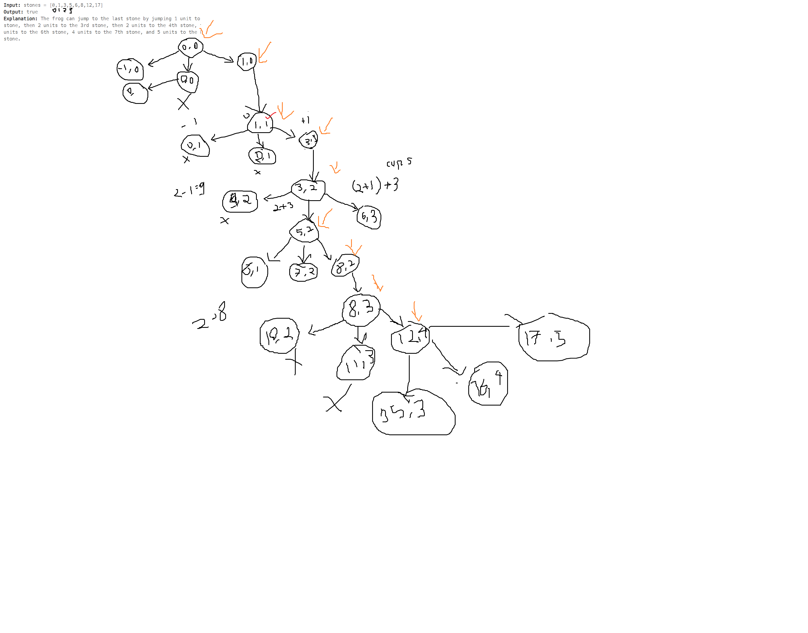

## 403. Frog Jump

This problem involved about, A frog is crossing a river. The river is divided into some number of units, and at each unit, there may or may not exist a stone. The frog can jump on a stone, but it must not jump into the water.

# Problem description

For better problem description, please visit [LeetCode Pages](https://leetcode.com/problems/frog-jump/description/)

**Approach :** 

-   

1. Create a memoization table to store whether it is possible to reach the last stone from each stone position and with each possible jump size.
2. Use a depth-first search (DFS) approach to explore all possible jump combinations from the current stone.
3. At each stone position, try all possible jump sizes (previousJump - 1, previousJump, previousJump + 1).
4. For each valid jump size, check if the next stone exists in the map (indicating it's a valid stone). If it does, recursively call the DFS function with the next stone index and the current jump size.
5. If the DFS function returns true, mark the current stone and jump size combination as reachable.
6. Return whether it's possible to reach the last stone starting from the first stone with valid jump sizes.

**Complexity Analysis :** 

-   Time-Complexity: `O(3 ^ n)` - Let `n` be the number of stones. The DFS function is called for each stone, and for each stone, it explores at most three possible jump sizes. So, the time complexity is `O(3 ^ n)`.

-   Space-Complexity: `O(n*m) + O(n)` - we are using an extra hash-table, as well as a two dimensional array to hold cache of each sub problems
