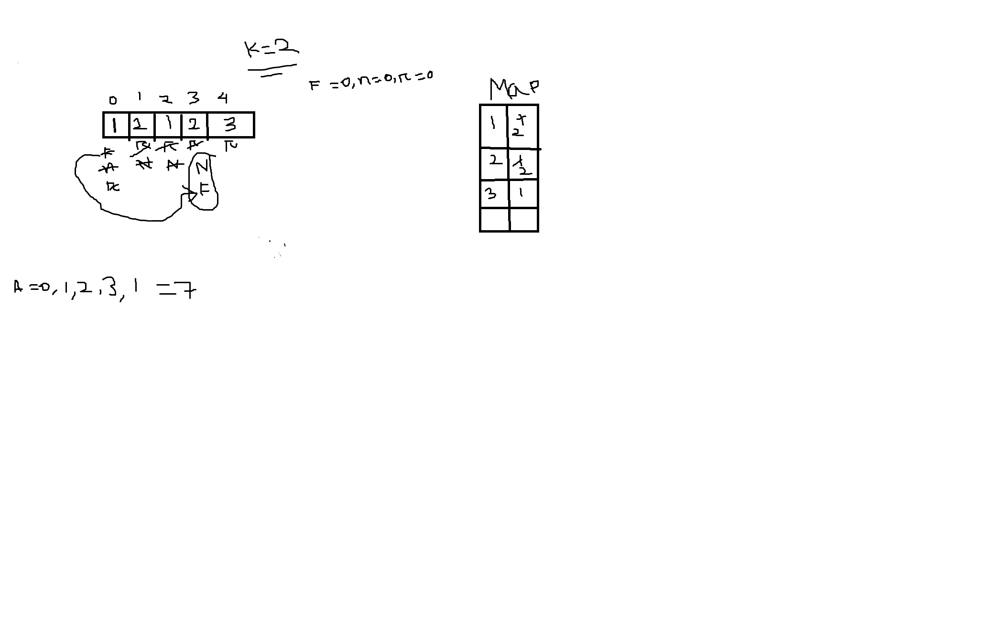

## 992. Subarrays with K Different Integers

This problem involved about, given an integer array nums and an integer k, return the number of good subarrays of nums. 

A good array is an array where the number of different integers in that array is exactly k.

# Problem description

For better problem description, please visit [LeetCode Pages](https://leetcode.com/problems/subarrays-with-k-different-integers/description/)

**Approach :** 

-   

1. **Initialization**:

    - Initialize variables:
        - `ans` to store the count of subarrays with exactly `k` distinct elements.
        - `left_near` and `left_far` pointers to track the left boundary of the sliding window.
        - Create an empty frequency map `freq` to store the count of distinct elements.

2. **Iterating through the array**:

    - Iterate through the array using the `right` pointer.
    - Increment the frequency of `nums[right]` in the `freq` map.

3. **Sliding Window Technique**:

    - While the size of the `freq` map exceeds `k`, indicating more than `k` distinct elements in the current window:
        - Decrement the frequency of `nums[left_near]`.
        - If the frequency becomes `0`, remove `nums[left_near]` from the `freq` map.
        - Move the `left_near` pointer to the right.
        - Update `left_far` to match `left_near`.

4. **Adjusting Frequency**:

    - While the frequency of `nums[left_near]` is greater than `1`, indicating duplicates:
        - Decrement its frequency.
        - Move the `left_near` pointer to the right.

5. **Updating Answer**:

    - If the size of the `freq` map is equal to `k`, indicating exactly `k` distinct elements in the current window:
        - Update the answer by adding the count of valid subarrays formed by the window, calculated as `(left_near - left_far) + 1`.

-   The space complexity is `O(n)` due to the additional space used for the `freq` map, which can store at most `n` elements.

**Complexity Analysis :** 

-   Time-Complexity: `O(n)` - where `n` is the number of elements in the input `nums`
-   Space-Complexity: `O(n)` - due to the additional space used for the `freq` map, which can store at most `n` elements.
